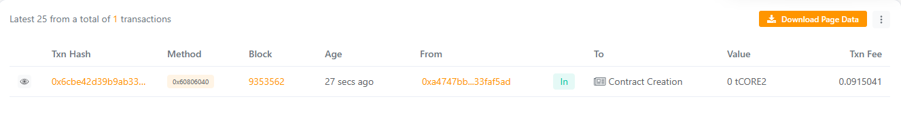

# 🌟 DappMint

## 🧩 Project Description
**DappMint** is a decentralized application (DApp) that allows users to **mint digital tokens** (NFT-style assets) directly on the blockchain. It is a lightweight, demo-friendly smart contract built in Solidity for easy understanding of DApp deployment and ownership management.

---

## 🎯 Project Vision
To create a **minimal, educational, and extensible** blockchain minting platform where developers and learners can:
- Experiment with Solidity basics.
- Understand smart contract deployment using Hardhat.
- Build upon this foundation for real NFT or asset-minting projects.

---

## 🔑 Key Features
- **Mint Tokens:** Users can mint unique tokens with metadata (like image URLs or descriptions).
- **Ownership Control:** Contract includes an owner with administrative privileges.
- **User Mint History:** Each user can view all tokens they have minted.
- **Event Logging:** All mint and ownership events are recorded on-chain.

---

## 🚀 Future Scope
- Integration with IPFS for decentralized storage of metadata.
- Frontend DApp using React + Ethers.js for easy interaction.
- ERC-721 standard compliance for true NFT minting.
- Minting fees and on-chain royalties.

---

## 📜 Deployment Information
After deployment, update this section with your live contract address:

Contract Address - 0xab08da3F495Df4531307A16B57C9015f6241aF42
